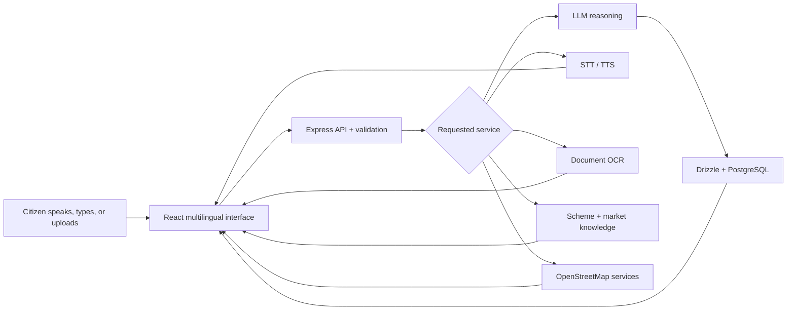

<div align="center">

# AI-SAHAYAK

## DIGITAL SEVA COMPANION FOR BHARAT


**Voice-first access to schemes, eligibility, market information, documents, nearby services, and official drafts.**

[Open AI-Sahayak](https://aisahayak.netlify.app) · [API reference](API.md) · [Deployment guide](DEPLOYMENT.md)

</div>

## The public-service desk

This is a genuine capture of the deployed interface.

[](https://aisahayak.netlify.app)

## One doorway, many citizen journeys

| Need | AI-Sahayak route | Intended outcome |
|---|---|---|
| Ask without typing | Voice Assistant | Speech → transcript → helpful response → spoken playback |
| Understand benefits | Eligibility Checker | Scheme fit, reasoning, documents, and next steps |
| Check farm economics | Market Data | Commodity prices, trends, and voice summaries |
| Continue a question | Chat Assistant | Multilingual conversational guidance |
| Understand paperwork | Document Analyzer | OCR, simplification, translation, and read-aloud |
| Find help nearby | Service Discovery | Hospitals, banks, police, offices, and schools |
| Prepare an application | Draft Generator | Editable letters, requests, complaints, and certificates |

## Assistance pipeline



## Language bridge

The interface is designed for English plus Hindi, Tamil, Telugu, Bengali, Marathi, Gujarati, Kannada, Malayalam, and Punjabi. Language selection and text-to-speech are treated as core navigation tools rather than optional decoration.

## Start a local seva desk

Prerequisites: Node.js 18+ and PostgreSQL.

```bash
git clone https://github.com/QizarBilal/ai-sahayak.git
cd ai-sahayak
npm install
cp .env.example .env
npm run db:push
npm run dev
```

Open `http://localhost:5000`.

The environment template documents the integration variables. Populate only the providers you intend to use and keep real credentials outside version control.

## Repository layers

```text
client/          React, Wouter, TanStack Query, shadcn/ui, Framer Motion
server/          Express routes, provider integrations, application services
shared/          Drizzle schema and cross-layer contracts
API.md           route-level reference
DEPLOYMENT.md    production and infrastructure notes
Dockerfile       container build
```

## Data responsibilities

The schema covers users, voice queries, conversations, messages, eligibility checks, documents, service searches, drafts, and market searches. Deployments handling real citizen data should define retention periods, deletion workflows, encryption, audit access, and consent before storing uploads or identity-linked history.

## Security action required

This repository currently contains a tracked `.env` file. Its contents are intentionally not reproduced here. Treat every credential that has ever appeared in that file as exposed:

1. revoke and rotate each affected credential at its provider;
2. purge secrets from Git history if the repository will remain public;
3. keep only `.env.example` in source control;
4. inject production values through the hosting platform;
5. confirm client bundles and logs do not reveal server-only keys.

Rotating the working-tree file alone does not remove a credential from earlier commits.

## Responsible-use boundary

AI-Sahayak can explain and guide, but it should not be presented as an official government portal or as the final authority on eligibility, prices, legal documents, or emergency services. Production responses should show source, freshness, jurisdiction, uncertainty, and official verification links. Sensitive documents require explicit consent and a clear deletion path.

## Service-readiness checklist

- Test every supported language with text, speech recognition, and playback.
- Verify keyboard-only and screen-reader navigation across all modules.
- Exercise slow, missing, and rate-limited provider responses.
- Validate file type, size, malware scanning, retention, and deletion.
- Confirm scheme and market claims display source and update time.
- Test low-bandwidth mobile behavior and browser speech fallbacks.
- Review all AI-generated drafts before submission to any authority.

## License

Released under the [MIT License](LICENSE).

<div align="center">

`LISTEN · UNDERSTAND · GUIDE · VERIFY`

Built to make digital public services easier to approach—not harder to trust.

</div>
